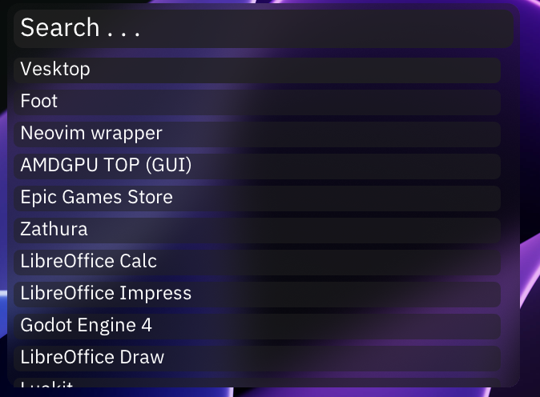

# basket
Basket is a small (~500 LoC), fast, minimal app launcher for Wayland compositors implementing the wlr-layer-shell protocol. \
It's not suitable for use just yet. You can't even customize it without editing the source code right now! \

# Features
* Configuration via JavaScript, powered by the [Bali](https://github.com/ferus-web/bali) JavaScript engine!
* Fuzzy find search for apps
* Save usage history to access your most accessed programs faster

# Roadmap
* Image Icons
* Crawler Cache
